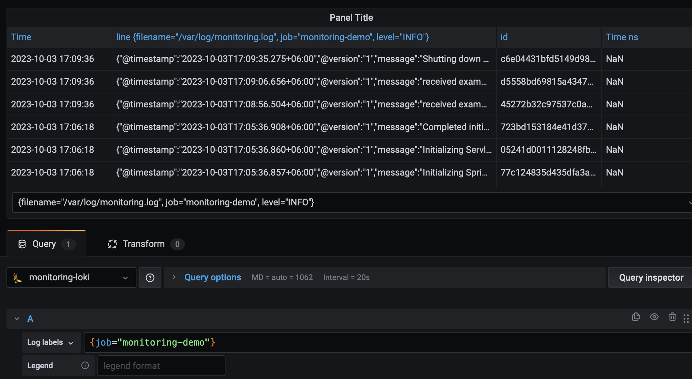
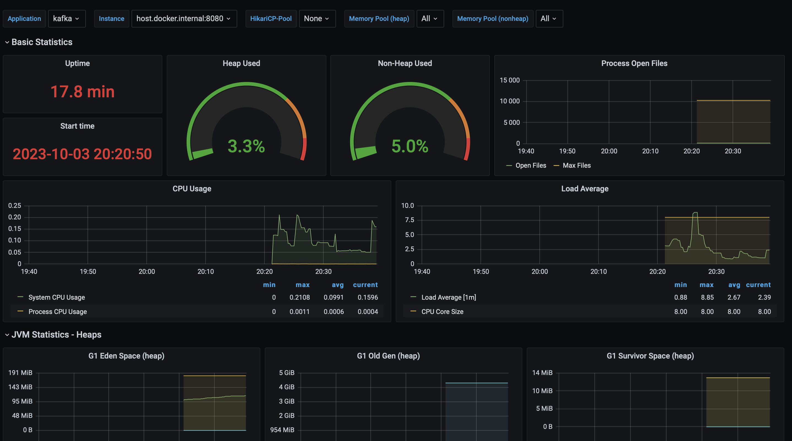

# Monitoring application

## Overview
1) endpoint получения метрик для prometheus: http://localhost:8080/actuator/prometheus
2) prometheus: http://localhost:9090/
3) grafana: http://localhost:3000/
4) loki logs:  
5) Spring Boot Statistics :
6) 
  